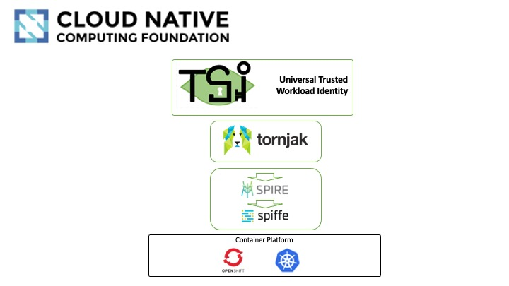

# Trusted Service Identity (TSI)

This Universal Workload Identity project
(also known as Trusted Service Identity)
provides a deployment and an orchestration layer to support
CNCF community initiatives
[Tornjak](https://github.com/spiffe/tornjak)
and [SPIRE](https://github.com/spiffe/spire).

*Notice1:*
* For all the original *Trusted Workload Identity* project,
that was preceding the SPIRE and Tornjak integration,
and focusing on keys and credentials management, and preventing
access to secrets by untrusted administrator,
please visit our [main-no-spire](../../tree/main-no-spire/) branch.

*Notice2:*
* The TSI version [tsi-version.txt] attempts to match the most
recent SPIRE version that is currently supported by Tornjak.
(See the
[Tornjak version](https://github.com/spiffe/tornjak/blob/main/SPIRE_BUILD_VERSIONS)
file)

## Introduction
Here is the stack that represents the layers of
the Universal Workload Identity project.
Most of the components are part of the [CNCF](https://www.cncf.io/)
(Cloud Native Computing Fundation) initiative.

Starting from the bottom, we support any Kubernetes Platform, whether this is
a native Kubernetes or OpenShift.

Then we have SPIFFE, which defines the identity format and specifies how
workloads can securely obtain identity.

Then we have SPIRE, which implements SPIFFE,
and it provides the zero trust attestation of workloads and infrastructure.
SPIRE is responsible for issuing and rotating of x509 certificates or
JWT tokens that are used for representing identity.
SPIRE also provides a single point of federation with OIDC discovery
to be used across multi-cloud or multi-cluster deployments.

Above the SPIRE, we have Tornjak, a control plane and UI for SPIRE,
which together with the
[*K8s workload registrar*](https://github.com/spiffe/spire/blob/main/support/k8s/k8s-workload-registrar/README.md),
defines the organization-wise Universal Workload Identity schema.
It provides the identity management across the SPIRE servers.

Then on the top layer we have Universal Trusted Workload Identity that is a
guiding principle. It's a concept for using workload identity frameworks.
This is not a specific technology.

## Attributes of Universal Workload Identity
* Define a single, consistent organizational identity schema across clusters in different clouds
* Provide a Zero Trust workload identity framework with strong workload attestation with SPIRE + Cloud-provider Plugins with each K8s installation
* Manage and audit workload identity, attestation and policies for all k8s workloads in every cluster
* Linear and centralized management of identities/policies to handle quadratic complexity
* Single configuration per cloud to federate all cloud access
* Based on CNCF SPIFFE identity specification

The Universal, Zero Trust Workload Identity, runs on everything that
supports Kubernetes platform.
It strengthens the security, by executing the cloud-provider and the platform attestation of the hosting nodes.
It can support various identity mechanisms like IAM, Keycloak, and
open standards like OpenID using a consistent, universal identity schema.

## Tornjak Deployment and Demo examples
For the documentation about deploying Tornjak
with the SPIRE server
and various demo examples, please see our [documentation](./docs/README.md)

## Reporting security issues

Our [maintainers](./MAINTAINERS.md) take security seriously. If you discover a security
issue, please bring it to their attention right away!

Please DO NOT file a public issue, they will be removed; instead please reach out
to the maintainers privately.

Security reports are greatly appreciated, and Trusted Service Identity team will
publicly thank you for it.
