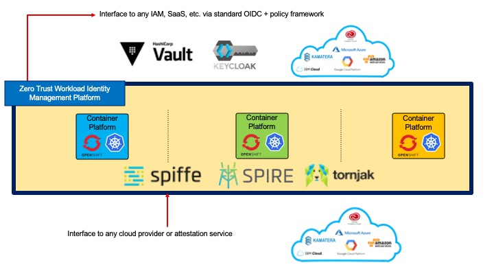

# Application Example using Universal Workload Identity with Tornjak and SPIRE

## Demo Overview
This example demonstrates a simple application that is using
Universal Workload Identity with Tornjak and SPIRE
to manage credentials stored securely in Vault.
There are two, independent web applications:
* [python](https://www.python.org/) (py)
* [Node.js](https://nodejs.org/en/) (node)
that connect to [MySQL](https://www.mysql.com/) (db) database that stores
sample data records.

Access to this DB instance is never provided to the sample applications during
the application deployment, but instead,
it is dynamically obtained from the secure Vault by the `sidecar`, based on
the application (workload) identity verified by OIDC.

This document describes the following steps:
* [Building the demo application](#building-the-demo-application)
* [Setting up Tornjak/SPIRE environment](#setting-up-tornjakspire-environment)
* [Setting up Vault instance with OIDC enablement](#setting-up-vault-instance-with-oidc-enablement)
* [Pushing the DB credentials to Vault](#pushing-the-db-credentials-to-vault)
* [Configuring and deploying the sample application](#configuring-and-deploying-the-sample-application)
* [Validating the application](#validating-the-application)(
* [Cleanup](#cleanup)


## Building the Demo application
This step is optional. You don't need to build your own images.
Instead, you can use the images publically available, stored in Docker Hub
[tsidentity](https://hub.docker.com/orgs/tsidentity) organization.

To build your own images,
You can change it to your own image repositity in [Makefile](./Makefile)

To build and push the images to the repository:
```console
make all
```

You can also build individual components e.g.
```console
make bin/python
make container-python
```

## Setting up Tornjak/SPIRE environment
This demo example can be running on any Kubernetes platform (Kind, Minikube, OpenShift,
IBM Cloud, AWS EKS, Azure etc.)

Install the Tornjak/SPIRE environment with OIDC Discovery for your platform,
as specified in [our tutorial](https://github.com/IBM/trusted-service-identity/blob/main/docs/spire-oidc-tutorial.md)

## Setting up Vault instance with OIDC enablement
Setup Tornjak with OIDC and Vault instance, by following the [tutorial](https://github.com/IBM/trusted-service-identity/blob/main/docs/spire-oidc-vault.md).

Create a vault instance per instructions [here](https://github.com/IBM/trusted-service-identity/blob/main/README.md#setup-vault).

Once Vault instance is up, setup the following environment variables:
* OIDC_URL
* ROOT_TOKEN
* VAULT_ADDR

Then run the [config/vault-oidc.sh](config/vault-oidc.sh) script.
This script will setup the permissions for accessing the secrets.
To change the policy role requirements, update the `sub` in `bound_claims`:

```json
"bound_claims": {
    "sub":"spiffe://openshift.space-x.com/region/*/cluster_name/*/ns/*/sa/*/pod_name/apps-*"
},
```

For example to restrict the access to US regions, and *my-app-sa* `ServiceAccount`
you can do a following:

```json
"bound_claims": {
    "sub":"spiffe://openshift.space-x.com/region/us-*/cluster_name/*/ns/*/sa/my-app-sa/pod_name/apps-*"
},
```

## Pushing the DB credentials to Vault
Now we can push our secret files to Vault. For this example we will be using two
files:
* config.json
* config.ini

Where the userid and password must match the DB values used in our
sample configuration [config/db-node.yaml](config/db-node.yaml)
---
** TODO we need to make sure the values match. Why do we have 2 passwds in ^^??***
---
where, for example, we can have *config.json*:
```json
{
    "host"     : "db",
    "port"     : "3306",
    "user"     : "root",
    "password" : "testroot",
    "database" : "testdb",
    "multipleStatements": true,
    "debug": false
}
```
Insert it into Vault as keys:

```console
vault kv put secret/db-config/config.json @config.json
# retrieve it to test: 
vault kv get -format=json secret/db-config/config.json
```

The second file needed is *config.ini*:
```
[mysql]
host=db
port=3306
db=testdb
user=root
passwd=testroot
```

Since this file is not in JSON format, we can use a trick to encode it and
store its encoded value as a key:

```console
SHA64=$(openssl base64 -in config.ini )
vault kv put secret/db-config/config.ini sha="$SHA64"
# then to retrieve it:
vault kv get -field=sha secret/db-config/config.ini | openssl base64 -d
```

## Configuring and deploying the sample application
First we need to deploy the MySQL database for storing the entries used by
`py` and `node` applications.

Deploy DB service:
```console
kubectl apply -f config/db-node.yaml
```
---
Before we run an application, we have to provide the Vault in the deployment file
[config/apps.yaml](config/apps.yaml) and update the value for *VAULT_ADDR* environment
variable to correspond with the VAULT_ADDR used above.

Start the deployment:

```console
kubectl -n default create -f config/apps.yaml
```

When deployed, the `sidecar` *containerInit* would run first, obtain the JWT token with
SPIFFE ID and pass it to Vault with a request to get the secure files.
Once the files are received, they are mounted to common directory available to
other containers in the pod, and the `sidecar`container exits.

Then, `node` and `py` start, and they can use these securely stored and transmitted files.

To deploy individual applications:
---
** TODO: need to add the sidecar into deployments **
---

Deploy Node App service
```
kubectl apply -f config/app-node.yaml
```
Deploy Pyton App service
```
kubectl apply -f config/app-python.yaml
```

## Validating the application
Now we need to access the applications. This process depends on the underlining
platform. Here we provide examples for Minikube, Kind and OpenShift in IBM Cloud.
Check with your service provider how to access the running containers via services.

<details><summary>Click to view Minikube steps</summary>

---
** TODO: These need to be updated **
---


Execute the following command to get the URL of the Node App:
```console
minikube service app-node -n default --url
```
We should see:
```
🏃  Starting tunnel for service app-node.
|-----------|----------|-------------|------------------------|
| NAMESPACE |   NAME   | TARGET PORT |          URL           |
|-----------|----------|-------------|------------------------|
| default   | app-node |             | http://127.0.0.1:59980 |
|-----------|----------|-------------|------------------------|
http://127.0.0.1:59980
❗  Because you are using a Docker driver on darwin, the terminal needs to be open to run it.
```
---

Execute the following command to get the URL of the Python App:
```console
minikube service app-py -n default --url
```
We should see:
```
🏃  Starting tunnel for service app-py.
|-----------|--------|-------------|------------------------|
| NAMESPACE |  NAME  | TARGET PORT |          URL           |
|-----------|--------|-------------|------------------------|
| default   | app-py |             | http://127.0.0.1:60042 |
|-----------|--------|-------------|------------------------|
http://127.0.0.1:60042
❗  Because you are using a Docker driver on darwin, the terminal needs to be open to run it.
```
</details>

<details><summary>Click to view Kind steps</summary>
---
** TODO: These need to be updated **
---
On kind, we can use port-forwarding to get HTTP access to applications:

kubectl -n default port-forward spire-server-0 10000:10000

Forwarding from 127.0.0.1:10000 -> 10000
Forwarding from [::1]:10000 -> 10000

Now you can test the connection to Tornjak server by going to http://127.0.0.1:10000 in your local browser.
</details>

<details><summary>Click to view OpenShift steps</summary>

First obtain the ingress name using ibmcloud cli:

```console
$ # first obtain the cluster name:
$ ibmcloud ks clusters
$ # then use the cluster name to get the Ingress info:
$ ibmcloud ks cluster get --cluster <cluster_name> | grep Ingress
Ingress Subdomain:              space-x04-9d995xxx4-0000.eu-de.containers.appdomain.cloud
Ingress Secret:                 space-x04-9d995xxx4-0000
Ingress Status:                 healthy
Ingress Message:                All Ingress components are healthy
```
Build an ingress file, using the Ingress Subdomain information obtained above.
Use any arbitrary prefix to distinguish the applications.
For example:

host: tsi-vault.my-tsi-cluster-9d995c4a8c7c5f281ce13xxxxxxxxxxx-0000.eu-de.containers.appdomain.cloud

```yaml
apiVersion: networking.k8s.io/v1
kind: Ingress
metadata:
  name: apps-ingress
  namespace: default
spec:
  rules:
  - host: py.space-x04-9d995xxx4-0000.eu-de.containers.appdomain.cloud
    http:
      paths:
      - pathType: Prefix
        path: "/"
        backend:
          service:
            name: apps
            port:
              number: 8000
  - host: node.space-x04-9d995xxx4-0000.eu-de.containers.appdomain.cloud
    http:
      paths:
      - pathType: Prefix
        path: "/"
        backend:
          service:
            name: apps
            port:
              number: 8001
```

Then access the service using the provided host values:
* http://py.space-x04-9d995xxx4-0000.eu-de.containers.appdomain.cloud
* http://node.space-x04-9d995xxx4-0000.eu-de.containers.appdomain.cloud

</details>

---
** TODO: describe how to operate (add/remove) entries into DB. **
---
** TODO: how to update the credentials
---


## Cleanup
---
Remove minikube instance
```
minikube delete
```
=======
# Trusted Service Identity (TSI)

This Universal Workload Identity project
(also known as Trusted Service Identity)
provides a deployment and an orchestration layer to support
CNCF community initiatives
[Tornjak](https://github.com/spiffe/tornjak)
and [SPIRE](https://github.com/spiffe/spire).

*Notice1:*
* For all the original *Trusted Workload Identity* project,
that was preceding the SPIRE and Tornjak integration,
and focusing on keys and credentials management, and preventing
access to secrets by untrusted administrator,
please visit our [main-no-spire](../../tree/main-no-spire/) branch.

*Notice2:*
* The TSI version [tsi-version.txt] attempts to match the most
recent SPIRE version that is currently supported by Tornjak.
(See the
[Tornjak version](https://github.com/spiffe/tornjak/blob/main/SPIRE_BUILD_VERSIONS)
file)

## Introduction
Here is the stack that represents the layers of
the Universal Workload Identity project.
Most of the components are part of the [CNCF](https://www.cncf.io/)
(Cloud Native Computing Fundation) initiative.


Starting from the bottom, we support any Kubernetes Platform, whether this is
a native Kubernetes or OpenShift.

Then we have SPIFFE, which defines the identity format and specifies how
workloads can securely obtain identity.

Then we have SPIRE, which implements SPIFFE,
and it provides the zero trust attestation of workloads and infrastructure.
SPIRE is responsible for issuing and rotating of x509 certificates or
JWT tokens that are used for representing identity.
SPIRE also provides a single point of federation with OIDC discovery
to be used across multi-cloud or multi-cluster deployments.

Above the SPIRE, we have Tornjak, a control plane and UI for SPIRE,
which together with the
[*K8s workload registrar*](https://github.com/spiffe/spire/blob/main/support/k8s/k8s-workload-registrar/README.md),
defines the organization-wise Universal Workload Identity schema.
It provides the identity management across the SPIRE servers.

Then on the top layer we have Universal Trusted Workload Identity that is a
guiding principle. It's a concept for using workload identity frameworks.
This is not a specific technology.

## Attributes of Universal Workload Identity
* Define a single, consistent organizational identity schema across clusters in different clouds
* Provide a Zero Trust workload identity framework with strong workload attestation with SPIRE + Cloud-provider Plugins with each K8s installation
* Manage and audit workload identity, attestation and policies for all k8s workloads in every cluster
* Linear and centralized management of identities/policies to handle quadratic complexity
* Single configuration per cloud to federate all cloud access
* Based on CNCF SPIFFE identity specification



The Universal, Zero Trust Workload Identity, runs on everything that
supports Kubernetes platform.
It strengthens the security, by executing the cloud-provider and the platform attestation of the hosting nodes.
It can support various identity mechanisms like IAM, Keycloak, and
open standards like OpenID using a consistent, universal identity schema.

## Tornjak Deployment and Demo examples
For the documentation about deploying Tornjak
with the SPIRE server
and various demo examples, please see our [documentation](./docs/README.md)

## Reporting security issues

Our [maintainers](./MAINTAINERS.md) take security seriously. If you discover a security
issue, please bring it to their attention right away!

Please DO NOT file a public issue, they will be removed; instead please reach out
to the maintainers privately.

Security reports are greatly appreciated, and Trusted Service Identity team will
publicly thank you for it.
