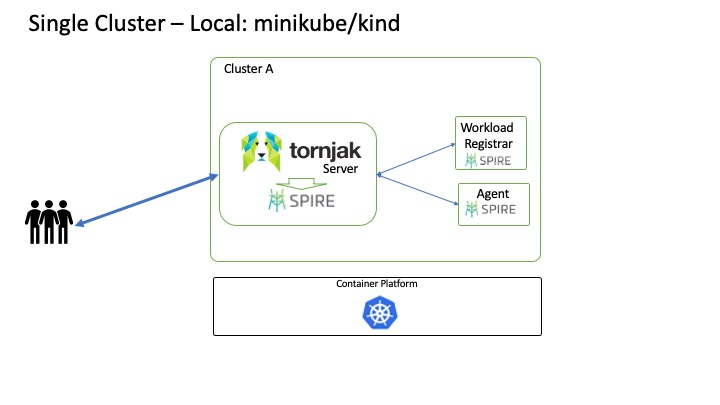
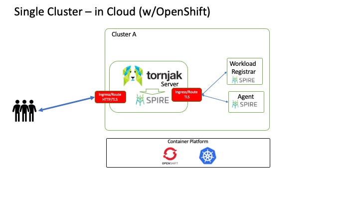
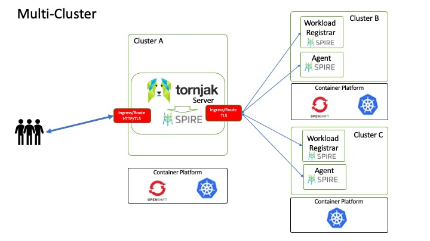

# Tornjak Deployment and Demos
This document describes the list of available documents to deploy and
run various Tornjak demos.

The demos are sorted by complexity,
starting with the simple ones and progressing into more complex.

We suggest running them in the specified order.

## Tornjak Deployment
There are multiple ways to deploy Tornjak on Kubernetes.
The simplest scenario is when Tornjak and SPIRE server
are deployed in the same cluster as the workloads and SPIRE agents.

### Single cluster on local `minikube` or `kind`

### Single cluster in the Cloud with OpenShift

### Multi-Cluster deployment

These demos deploy Tornjak Server and SPIRE agents in various scenarios:
1. Deploy in a single cluster locally [via helm charts](./spire-helm.md)
1. Deploy in IBM Cloud [via helm charts](./spire-helm.md)
1. Deploy on [OpenShift in IBM Cloud](./spire-on-openshift.md)
1. [Multi-cluster deployment](./spire-multi-cluster.md)
1. [SPIRE agents on AWS](./spire-on-aws.md)
1. Enable [User Management](./user-management.md) for Tornjak

## Tornjak use-cases
These demos showcase various experiments
1. [OIDC Tutorial](./spire-oidc-tutorial.md)
1. [OIDC for Vault](./spire-oidc-vault.md)
1. [AWS S3 storage access via OIDC](./spire-oidc-aws-s3.md)
1. [Identity Sidecar for Python and MySQL applications](../examples/spire-sidecar/README.md)
1. Enhanced [Security](./spire-security.md) configuration

## Other documentation
1. Our [Hints](./spire-hints.md) collection provides answers to various deployment problems
1. Documentation on configuring [SPIRE Workload Registrar](./spire-security.md)
1. Documentation on setting up [Vault](./vault.md)
1. [Keycloak Deployment](./keycloak.md) to support User Management for Tornjak